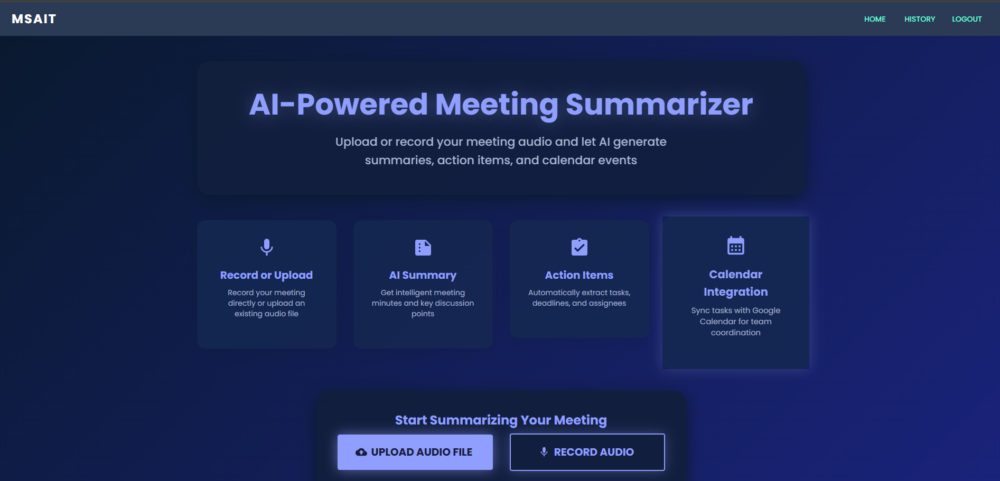
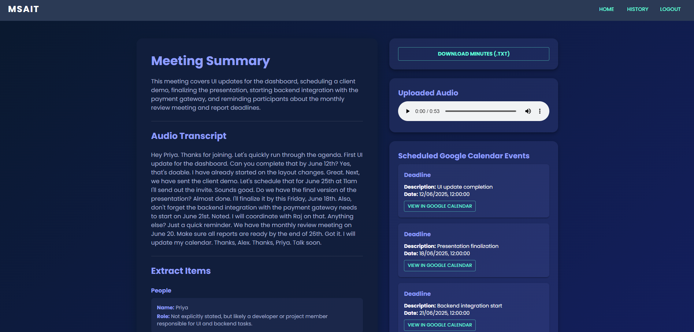

# AI-Powered Meeting Summarizer & Action Tracker


## Overview

This project is an AI-powered web application that helps you record or upload meeting audio, automatically transcribes and summarizes the meeting, extracts action items, and integrates with Google Calendar for seamless team coordination. Built with a React frontend and a Node.js/Express + Python backend, it leverages advanced AI models for transcription and natural language processing.

---

## Features

- **Record or Upload Audio**: Record meetings directly in the browser or upload existing audio files.
- **AI-Powered Transcription**: Uses AssemblyAI for accurate speech-to-text conversion.
- **Intelligent Summarization**: Summarizes meetings and extracts key discussion points using Google Gemini.
- **Action Item Extraction**: Automatically identifies tasks, deadlines, and assignees from your meetings.
- **Google Calendar Integration**: Sync action items and deadlines with your Google Calendar.
- **Meeting History**: Securely view your past meetings, summaries, and extracted items.
- **Download Minutes**: Download meeting summaries and transcripts as text files.
- **User Authentication**: Sign up and log in to keep your meeting data private.

---

## Screenshots

### Landing Page


### Meeting Details & Summary


---

## Getting Started

### Prerequisites
- **Node.js** (v16+ recommended)
- **Python** (v3.8+ recommended)
- **MongoDB** (local or Atlas cluster)

### Installation

#### 1. Clone the repository
```bash
git clone <repo-url>
cd MSAIT
```

#### 2. Install Client Dependencies
```bash
cd client
npm install
```

#### 3. Install Server Dependencies
```bash
cd ../server
npm install
```

#### 4. Install Python Dependencies
```bash
pip install assemblyai requests chrono-node
```

> **Note:**
> - `assemblyai` is required for speech-to-text (see `speech_to_text.py`).
> - `requests` is used for API calls in Python scripts.
> - `chrono-node` is used in Node.js for date parsing.

#### 5. Environment Variables
- Create a `.env` file in the `server/` directory with the following (replace with your actual keys):
  ```env
  JWT_SECRET=your_jwt_secret
  ASSEMBLYAI_API_KEY=your_assemblyai_api_key
  GEMINI_API_KEY=your_gemini_api_key
  MONGO_URI=your_mongodb_connection_string
  GOOGLE_CLIENT_ID=your_google_client_id
  GOOGLE_CLIENT_SECRET=your_google_client_secret
  GOOGLE_REDIRECT_URI=http://localhost:5000/api/google-auth-callback
  ```

---

## Running the App

### Start the Backend
```bash
cd server
node index.js
```

### Start the Frontend
```bash
cd client
npm start
```

- The frontend will run on [http://localhost:3000](http://localhost:3000)
- The backend will run on [http://localhost:5000](http://localhost:5000)

---

## Usage

1. **Sign Up / Log In**: Create an account or log in to access your meeting dashboard.
2. **Record or Upload**: Use the landing page to record audio or upload a meeting file.
3. **Processing**: The app will transcribe, summarize, and extract action items from your meeting.
4. **View Details**: Access meeting summaries, transcripts, and extracted items in the Meeting Details page.
5. **Calendar Integration**: Connect your Google account to sync action items and deadlines to your calendar.
6. **Download Minutes**: Download meeting minutes as a `.txt` file for sharing or archiving.

---

## Project Structure

```
MSAIT/
  client/      # React frontend
  server/      # Node.js/Express backend + Python scripts
  samples/     # Screenshots for documentation
```

---

## Technologies Used
- **Frontend**: React, Material-UI, Framer Motion
- **Backend**: Node.js, Express, MongoDB, Mongoose
- **AI/ML**: AssemblyAI (speech-to-text), Google Gemini (summarization & extraction)
- **Python**: For advanced NLP and integration scripts

---

## License
This project is for educational and demonstration purposes. 